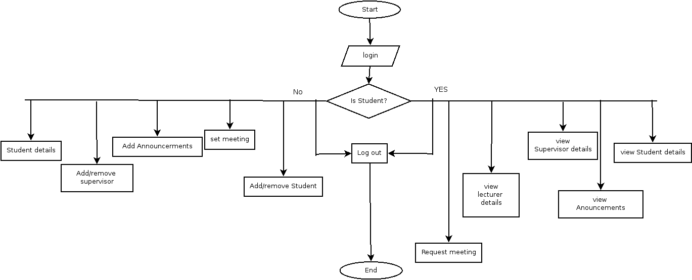

# WIL-Manager
Our first assignment for advanced programming

## Organization – Namibia university of science and technology
Our client is a university that’s main focus is science, technology, engineering and mathematics. 
They have a student mentoring programming that is called work integrated learning. During the final years of a students studies, they will join the work force and report to the head of department with regards to their work responsibilities and duties. 

## Proposed system
We will be creating a system that will allow for the head of department to easily manage the different students and receive as well as review daily reports.

## Flowchart

### Created by the Coding Crusaders at Namibia University of Science  and Technology in Namibia
- [Carlos da Costa](https://github.com/Calolocosta)
- [Daddy Vatillfa]()
- [Francis Emvula](https://github.com/Wombola)
